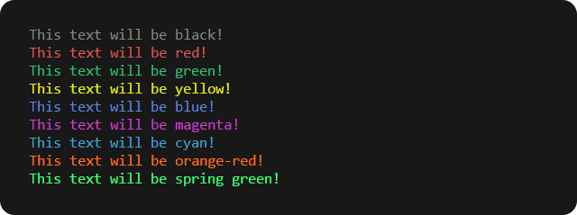

# Encolor

Encolor is a collection of functions that add ANSI color codes to terminal output, making it easier to colorize text. ANSI color codes are a set of escape codes that allow you to change the color and formatting of text in a terminal. By adding these codes to your output, you can highlight important information, distinguish between different types of messages, and make your console output more visually appealing.

Encolor currently includes 7 pre-defined color functions and the ability to define custom colors through hex and rgb values. It is written in TypeScript with type definitions for ease of use.

## Installation

You can install Encolor using npm:

```sh
npm install encolor
```

## Usage

Here's an example of how to use Encolor:

```js
const { encolor } = require("encolor");

console.log(encolor.black("This text will be black!"));
console.log(encolor.red("This text will be red!"));
console.log(encolor.green("This text will be green!"));
console.log(encolor.yellow("This text will be yellow!"));
console.log(encolor.blue("This text will be blue!"));
console.log(encolor.magenta("This text will be magenta!"));
console.log(encolor.cyan("This text will be cyan!"));
console.log(encolor.hex("This text will be orange-red!", "#FF6E15")); // Custom color through hex value
console.log(encolor.rgb("This text will be spring green!", { r: 0, g: 255, b: 127 })); // Custom color through rgb value
```



## Features

Encolor provides the following features:

- Pre-defined color functions for black, red, green, yellow, blue, magenta, and cyan
- Custom color functions through hex and rgb values
- Written in TypeScript with type definitions for ease of use

## Contributing

If you'd like to contribute to Encolor, please follow these guidelines:

1. Fork the project
2. Create a new branch (git checkout -b new-feature)
3. Make your changes and commit them (git commit -am 'Added a new feature')
4. Push your changes to your fork (git push origin new-feature)
5. Open a pull request

## Issues

If you encounter any issues with Encolor, please create a new issue on the GitHub repository.
